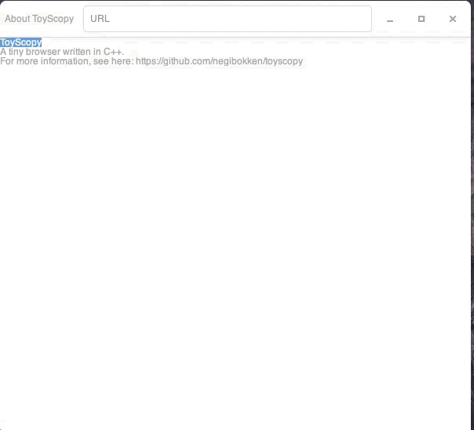

# ToyScopy

[](https://circleci.com/gh/negibokken/toyscopy/tree/master)
[](https://codecov.io/gh/negibokken/toyscopy)
[](./LICENSE)

ToyScopy is a toy browser written in C++.



## development

1. install gtk+3.0, gtkmm3 and adwaita-icon-theme

   ```sh
   brew install gtk+3.0 gtkmm3 adwaita-icon-theme
   ```
2. install libcurl
    - [ref](https://stackoverflow.com/questions/41580504/how-to-install-libcurl-under-macos10-12-and-use-for-xcode)
3. execute cmake under src directory

   ```sh
   cd src
   cmake .
   ```

4. make binary

   ```sh
   make
   ```

5. execute ToyScopy

   ```sh
   ./main
   ```

   - for checking debug log, execute with `DEBUG=true` like below:

   ```sh
   DEBUG=true ./main
   ```

## license

MIT
